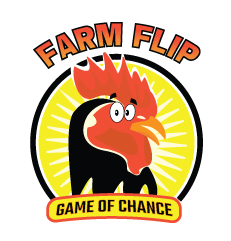
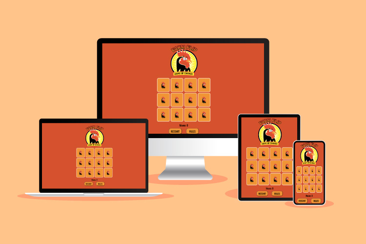

<h1 align="center"></h1>

# Farm Flip 

## Portfolio Project 2 - Javascript Essentials

I have created a farm animal themed card flip memory game geared towards a younger target audience, but suitable for
all ages. I hope to provide a fun, colourful and interactive gaming experience!

<h1 align="center"></h1>

# Planning

## Target Audience
<ul>
<li>Those looking for a fun, interactive online card game</li>
<li>Younger children who wish to flip the cards and find a match</li>
<li>For the older audience who wish to challenge themselves and try beat their previous moves score</li>
</ul>

## Web Owner Goals
<ul>
<li>Appeal to the interest of the target audience</li>
<li>Create excitment through the website via bright colours and fun visuals</li>
<li>Create a light-hearted challenge</li>
<li>Create a clear website and game, where the user fully understands the core concept</li>
</ul>

# Features

## Design Elements

The colour scheme was inspired from a previous personal design project I had worked on in the past, updated with additional colours and elements to suit it to the game concept. When brainstorming ideas for the game site, I knew instantly that I wanted to incorporate one of my graphic cartoons into the game to bring it to life in a real-life web game setting. 
The core concept of farm animals was decided upon after choosing my logo from my Graphic Design portfolio, and the name 'Farm Flip' came to me in a short brainstorming session with pen and paper writing out words that rhyme with farm animals and card games.

<h1 align="center"></h1>

## Wireframes

In the planning stages, I used Adobe illustrator to play around with the elements before starting the project. I had an initial idea in my head to layout the elements side-by-side, as pictured below. Once I got to the styling elements of the design, I realised this would not be the ideal layout with user-experience in mind as it's not fluid and there's no visual hierarchy.
<h1 align="center"></h1>

I went back to my artboard and decided that stacking them centred in block formation was more appealing to the eye, and this was the visual idea I came up with that I went into the project with.

<h1 align="center"></h1>

## Research

I searched for similar card style games on both my app store and online for card-based memory style games for inspiration. I also watched several YouTube tutorials to see what ideas I liked from various elements applied to their game projects, and how I might incorporate them into mine. Geeks For Geeks is a great platform for walk throughs on building a memory game, so i read through some of their resources in my research phase.

# Features

## Logo 

The logo was inpired by a previous design I did for a fictitius chicken restaurant, and i changed the lettering for this gaming project. The logo in turn inspired the entire theme of the game.
<h1 align="center"></h1>

## Game Grid & Cards
The gaming grid consists of 4x3, 12 cards in total. This number of cards was chosen to keep the game at an adequate pace, especially for younger players, and to also work well on smaller screen sizes. The colour orange was chosen to compliment the chicken logo colours and background,while the white outline was chosen to compliment the white background of the main logo character.
<h1 align="center"></h1>

## Game Characters
I chose the gaming characters based off the farm theme concept, and found a suitable character set to fit the game style. I wanted the imagery to have a similarity to the types of farming animals you would find in a children's book.
<h1 align="center"></h1>

## Navigation

For the navigation buttons I chose the Oswald font as I wanted a sans-serif similar to the font I manipulated on the logo. I chose the same orange as the card back to keep the visual design elements in line with one another. The borders are rounded off and the curser will change to a pointer once hovered over.
<h1 align="center"></h1>

## Moves
I wanted to keep the moves tracker quite simple, similar to that of other online games, or an old school arcade type of game. The font family and style is the same used as the navigation buttons and the move counter sits directly below the game grid.
<h1 align="center"></h1>

## Rules Modal
Upon clicking the rules button, a display modal appears explaining how to play the game. I put an opacity overlay in the board background when the modal is active to add a bit more styling. The modal itself is bright yellow, the same as the yellow featured in the logo, and the font is the same Oswald font used throughout the project for consistency.
<h1 align="center"></h1>

## Win Alert

When all cards are turned and the game is over, a pop-up win alert will be triggered. Once the player hits "Ok", all cards will reset, reshuffle and move counter will go back to "0" to prepare for a new game.

# Features Left To Implement

<ul>
<li>Addition of a win modal displaying the moves taken.</li>
<li>Addition of a highest score leaderboard would be a nice addition I would like to add, for the player to see their own highest scores to try and beat previous personal bests.</li>
<li>The implementation of moving imagery, where I can animate the logo and cause the characters to move when a matching pair is found. Similar to how you would see a card game in a casino on screen.</li>
</ul>

# Testing

<ul>
<li>The site has been tested on Chrome, Safari & Firefox</li>
<li>Testing has been implemented on various screen sizes to ensure responsivness across devices. Ipad, Galaxy and laptop testing has been implemented and passed.</li>
</ul>

## Validator Testing

## HTML:

## CSS:

## Lighthouse Report:

# Bugs/Errors or Issues Encountered
<ul>
<li>I encountered some issues with the positioning within CSS when I was first piecing everything together with the layout. It was an easy fix in the end and had to do with flex boxes causing me problems.</li>
<li>I had some initial issues with syncing up the move counter within the function, after watching several more online tutorials, I managed to figure it out and get it to work.</li>
<li>I ran into some confusion with the endGame function when it was being called. Initially, it would pop up at the wrong time, but upon contacting tutoring services, they helped put me on the right path. It was a minor issue that I managed to resolve.</li>
</ul>

# Deployment

The site was deployed to GitHub pages - <a href ="https://lauramayfox.github.io/farm-flip/">Live Link</a>

## Steps To Deployment
<ul>
<li>Log onto GitHub and locate the repository.</li>
<li>On the options bar, hit the settings.</li>
<li>Go to the pages tab on the left hand side bar.</li>
<li>Choose 'Master' in the source options drop down menu (default will be 'None).</li>
Click save.
<li>Wait a few minutes for the changes to be updated and created.</li>
<li>Once ready, the update will prompt "Your site is live at https://lauramayfox.github.io/farm-flip/ (Last deployed by lauramayfox)" with the option to click on the 'Visit Site' button to the right of this.</li>
</ul>

# Credits 

## Content
<ul>
<li>Javascript tutorial followed/adapted <a href="https://www.youtube.com/@CodeSketchLab" target="_blank">Code Sketch YouTube</a></li>
<li>Javascript tutorial followed/adapted <a href="https://www.youtube.com/@JsAcademyOfficial" target="_blank">Javascript Academy Youtube YouTube</a></li>
<li>General source: <a href="https://www.w3schools.com" target="_blank">W3Schools</a><li>
<li>General source: <a href="https://www.geeksforgeeks.org" target="_blank">Geeks For Geeks</a><li>
<li>General source: <a href="https://www.stackoverflow.com" target="_blank">Stack Overflow</a><li>
</ul>

## Formatting
<ul>
<li>Javascript formatting tool:<a href="https://www.prettier.io" target="_blank">Prettier</a></li>
<li>HTML & CSS formatting tool: <a href="https://www.freeformatter.com" target="_blank">Free Formatter</a></li>
</ul>

## Media:
<ul>
<li>Font: <a href="https://fonts.google.com/" target="_blank">Google Fonts</a></li>
<li>Card front imagery source: <a href="https://freepiks.com" target="_blank">FreePiks</a></li>
<li>Logo llustration: Own content</li>
</ul>
