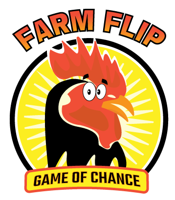

<h1 align="center"></h1>

# Farm Flip 

## Portfolio Project 2 - Javascript Essentials

I have created a farm animal themed card flip memory game geared towards a younger target audience, but suitable for
all ages. 

<h1 align="center"></h1>

# Planning

## Target Audience
<ul>
<li>Those looking for a fun, interactive online card game</li>
<li>Younger children who wish to flip the cards and find a match</li>
<li>For the older audience who wish to challenge themselves and try beat their previous moves score</li>
</ul>

## Web Owner Goals
<ul>
<li>Appeal to the interest of the target audience</li>
<li>Create excitment through the website via bright colours and fun visuals</li>
<li>Create a light-hearted challenge</li>
<li>Create a clear website and game, where the user fully understands the core concept</li>
</ul>

# Features

## Design Elements

The colour scheme was inspired from a previous personal design project I had worked on in the past, updated with additional colours and elements to suit it to the game. When brainstorming ideas for the game site, I knew instantly that I wanted to incorporate one of my graphic cartoons into the game to bring it to life in a real-life web game setting. The farm theme is meant to be fun and visually appealing to the player.

<h1 align="center"></h1>

## Wireframes

In the planning stages, I used Adobe illustrator to play around with the elements before starting the project. I had an initial idea in my head to layout the elements side-by-side, as pictured below. Once I got to the styling elements of the design, I realised this would not be the ideal layout with user-experience in mind as it's not fluid and there's no visual hierarchy.
<h1 align="center"></h1>

I went back to my artboard and decided that stacking them centred in block formation was more appealing to the eye, and this was the visual idea I came up with that I went into the project with.

<h1 align="center"></h1>

## Research

I searched for similar games on my app store for card-based memory style games for inspiration. I also watched several YouTube tutorials to see what ideas I liked from various elements applied to their game projects. 

# Features

## Logo 
<h1 align="left"></h1>

## Background

<h1 align="center"></h1>

## Game Grid

<h1 align="left"></h1>

## Game Characters

<h1 align="center"></h1>

# Features Left To Implement

<ul>
<li>In the future I would like to split the gallery into another page where reader's own submissions can be posted and keep a separate archive gallery for the older pictures that can be found online.</li>
<li>Another page idea would be to create an entire timeline, with dates, facts and pictures throughout the years.</li>
<li>A FAQ section to answer the questions that are likely going to be asked through the contact form</li>
<li>An online store which will feature merchandise and art relating to the old hotel, potentially in collaboration with local artists.</li>
</ul>

# Testing

<ul>
<li>The site has been tested on Chrome, Safari & Firefox</li>
<li>Testing has been implemented on various screen sizes to ensure responsivness across devices. Ipad, Galaxy and laptop testing has been implemented and passed.</li>
<li>Social media links, footer links and other page links as well as contact form validation have all been tested and passed. </li>
</ul>
Validator Testing

## HTML:

## CSS:

## Lighthouse report:

<h1 align="center"></h1>
<h1 align="center"></h1>

# Bugs/Errors
<ul>
<li>I fixed some intitial bugs relating to hierarchy on the homepage. The hero image text was warning me not to use H1, as the header already contained an H1 element. Same issue on the footer with hierarchy and headers. Both issues resolved.</li>

<li>The CSS had some bug fixes relating to extra brackets which was fixed.</li>

# Deployment

The site was deployed to GitHub pages - https://lauramayfox.github.io/latouchehotel/ 

## Steps To Deployment

<h1 align="left"></h1>

# Credits 

## Content

The article text for the Home page was taken from: <a href="https://www.independent.ie/regionals/wicklow/bray-news/old-hotel-is-transformed/39730580.html" target="_blank">The Irish Independent</a>

Header: Love Running project walk-through to build the responsive header.

Footer: The Web Shala (YouTube) walk through video on how to contruct a responsive footer

Contact section: Adaption of <a href="https://www.w3schools.com" target="_blank">W3Schools</a> walk through form building tutorial.

Hero image section: Hero banner image walk-through by Career & Tech HQ (YouTube).

Gallery: Layout tutorial from W3Schools responsive image gallery tutorial

## Media:
<ul>
<li>Gallery Photos & Hero Image: Historical Greystones archieve on Facebook, Greystones Guide</li>
<li>Fonts: <a href="https://fonts.google.com/" target="_blank">Google Fonts</a></li>
<li>Favicon: Prashanth Rapolu on <a href="https://freepiks.com" target="_blank">FreePiks</a></li>
<li>Footer social media icons: <a href="https://fontawesome.com" target="_blank">Font Awesome</a></li>
<li>Illustrations: Own content</li>
</ul>
